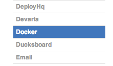
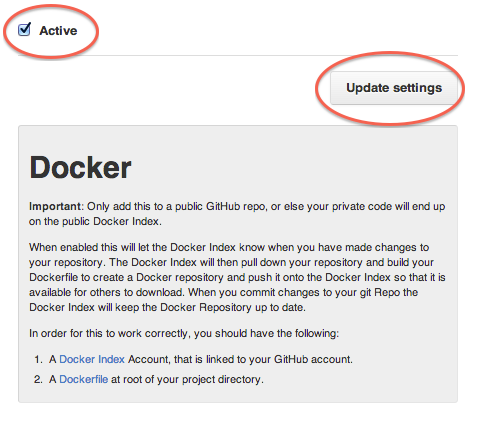

Docker Hub上的自动化构建
===

##关于自动化构建

自动化构建是一个特殊的功能，它允许您在 Docker Hub 上使用构建集群，根据指定的 `Dockerfile` 或者 GitHub 、 BitBucket 仓库（或环境）来自动创建镜像。该系统将从仓库复制一份，并根据以仓库为环境的 `Dockerfile` 的描述构建镜像。由此产生的镜像将被上传到注册表，并且自动生成标记。

自动化构建有许多优势：

* 你的自动化构建项目一定是准确按照预期构建的
* 在 Docker Hub 注册表上，任何拥有你仓库访问权限的用户都乐意浏览 `Dockerfile`
* 自动化构建保证了你的仓库总是最新的

自动化构建支持 [GitHub](http://GitHub.com/) 和 [BitBucket](https://bitbucket.org/) 的私有和公有的仓库。

要使用自动化构建，你必须拥有经过验证有效的 Docker Hub 账户和 GitHub/Bitbucket 账户。

##设置GitHub自动化构建

首先，你需要将 GitHub 账户链接到你的 [Docker Hub](https://hub.docker.com/) 账户，以允许注册表查看你的仓库。

>注：目前我们需要有读写权限以建立 Docker Hub 和 GitHub 的挂钩服务，这是GitHub管理权限的方式，我们别无选择。抱歉！我们将保护您的账户及隐私，确保不会被他人非法获取。

开始构建！登录到你的 Docker Hub 账户，点击屏幕右上方的 "+ Add Repository" 按钮，选择[自动化构建](https://registry.hub.docker.com/builds/add/)。

选择[GitHub服务](https://registry.hub.docker.com/associate/GitHub/)

然后按照说明授权和连接你的 GitHub 账户到 Docker Hub。连接成功后，你就可以选择用来自动化构建的仓库了。

###创建一个自动化构建项目

你可以用你的 `Dockerfile` 从你的公共或者私有仓库[创建一个自动化构建项目](https://registry.hub.docker.com/builds/GitHub/select/)。

###GitHub子模块

如果你的 GitHub 仓库包含了私有子模块的连接，你需要在 Docker Hub 上添加部署秘钥。

部署秘钥位于自动化构建主页的 “Build Details” 菜单。访问设置 GitHub 仓库的页面，选择 “Deploy keys” 来添加秘钥。

<table class="table table-bordered">
  <thead>
    <tr>
      <th>Step</th>
      <th>Screenshot</th>
      <th>Description</th>
    </tr>
  </thead>
  <tbody>
    <tr>
      <td>1.</td>
      <td></td>
      <td>你的自动化构建部署秘钥位于 “Build Details” 菜单的 “Deploy keys” 下。</td>
    </tr>
    <tr>
      <td>2.</td>
      <td></td>
      <td>在你的 GitHub 子模块仓库设置页，添加部署秘钥。</td>
    </tr>
  </tbody>
</table>

###GitHub组织

一旦你的组织成员身份设置为公开，对应的 GitHub 组织状态便会被公开在你的 GitHub 上。为了验证，你可以查看 GitHub 上你的组织的成员选项卡。

###GitHub服务挂钩

按照以下步骤配置自动化构建的 GitHub 服务挂钩:

<table class="table table-bordered">
  <thead>
    <tr>
      <th>Step</th>
      <th>Screenshot</th>
      <th>Description</th>
    </tr>
  </thead>
  <tbody>
    <tr>
      <td>1.</td>
      <td></td>
      <td>登录到 GitHub.com，并转到您的仓库页面，点击右侧页面“Settings”。
	执行该操作要求你有该仓库的管理员权限。</td>
    </tr>
    <tr>
      <td>2.</td>
      <td></td>
      <td>点击页面左侧的“Webhooks & Services”。</td></tr>
      <tr><td>3.</td>
      <td></td><td>找到 "Docker" 并点击它.</td></tr>
      <tr><td>4.</td><td></td>
      <td>确认 "Active" 被选中，然后点击 “Update service” 按钮以保存您的更改。</td>
    </tr>
  </tbody>
</table>

##设置BitBucket自动化构建

为了设置自动化构建，你需要先把 BitBucket 连接到你的 Docker Hub 账户，以允许其访问你的仓库。

登录到你的 Docker Hub 账户，点击屏幕右上方的 "+ Add Repository" 按钮，选择[自动化构建](https://registry.hub.docker.com/builds/add/)。

选择的 [Bitbucket 服务](https://registry.hub.docker.com/associate/bitbucket/)。 

然后按照说明授权和连接你的 Bitbucket 账户到 Docker Hub。连接成功后，你就可以选择用来自动化构建的仓库了。

###创建自动化构建项目

你可以用你的 `Dockerfile` 从你的公共或者私有仓库[创建一个自动化构建项目](https://registry.hub.docker.com/builds/bitbucket/select/)。

###Bitbucket服务挂钩

当你成功连接账户以后，一个 `POST` 挂钩将会自动被添加到你的仓库。请按照以下步骤确认或者更改你的挂钩设置：

<table class="table table-bordered">
  <thead>
    <tr>
      <th>Step</th>
      <th>Screenshot</th>
      <th>Description</th>
    </tr>
  </thead>
  <tbody>
    <tr>
      <td>1.</td>
      <td></td>
      <td>登录到 Bitbucket.org 进入仓库页面。点击左侧导航下的 “Settings”。执行该操作要求你有该仓库的管理员权限。</td>
    </tr>
    <tr>
      <td>2.</td>
      <td></td>
      <td>点击左侧 “Settings” 下的 "Hooks"。</td></tr>
    <tr>
      <td>3.</td>
      <td></td><td>现在你应该能看到关联了该仓库的挂钩列表，包括一个指向 registry.hub.docker.com/hooks/bitbucket 的 <code>POST</code> 挂钩。</td>
    </tr>
  </tbody>
</table>

##Dockerfile和自动化构建

在构建过程中，我们将复制 `Dockerfile` 的内容。我们也将添加它到 Docker Hub 上，使得 Docker 社区（公共仓库）或者得到许可的团队成员可以访问仓库页面。

##README.md

如果你的仓库有一个 `README.md` 文件，我们将使用它作为仓库的描述。构建过程中会寻找 `Dockerfile` 同一目录下的 `README.md`。

>警告：如果你需要在创建之后修改描述，它会在下一次自动化构建完成之后生效。

###建立触发器

如果你需要 GitHub 或者 BitBucket 以外的方式来触发自动化构建，你可以创建一个构建触发器。当你打开构建触发器，它会提供给你一个 url 来发送 POST 请求。这将触发自动化构建过程，类似于 GitHub webhook。

建立触发器可在自动化构建项目的 Settings 菜单中设置。

>注：你在五分钟内只能触发一个构建，如果你已经进行一个构建，或你最近提交了构建请求，这些请求将被忽略。你可以在设置页面来找到最后10条触发日志来验证是否一切正常工作。

###Webhooks

也可以使用 Webhooks 来自动化构建，Webhooks 会在仓库推送成功后被调用。

此webhook调用将生成一个 HTTP POST，JSON样例如下：

	{
	   "push_data":{
	      "pushed_at":1385141110,
	      "images":[
	         "imagehash1",
	         "imagehash2",
	         "imagehash3"
	      ],
	      "pusher":"username"
	   },
	   "repository":{
	      "status":"Active",
	      "description":"my docker repo that does cool things",
	      "is_automated":false,
	      "full_description":"This is my full description",
	      "repo_url":"https://registry.hub.docker.com/u/username/reponame/",
	      "owner":"username",
	      "is_official":false,
	      "is_private":false,
	      "name":"reponame",
	      "namespace":"username",
	      "star_count":1,
	      "comment_count":1,
	      "date_created":1370174400,
	      "dockerfile":"my full dockerfile is listed here",
	      "repo_name":"username/reponame"
	   }
	}

Webhooks 可在自动化构建项目的 Settings 菜单中设置。

>注意：如果你想测试你的 webhook，我们建议使用像 [requestb.in](http://requestb.in/) 的工具。 

###仓库链接

仓库链接是一种建立自动化项目与项目之间关联的方式。如果一个项目得到更新，连接系统还会触发另一个项目的更新构建。这使得你可以轻松地让所有关联项目保持更新同步。

要添加链接的话，访问你想要添加链接的项目的仓库设置页面，在设置菜单下地右侧点击 “Repository Links”。然后输入你想要与之链接的仓库名称。

>警告：您可以添加多个仓库的链接，但要小心。自动化构建之间的双向关系会造成一个永不停止的构建循环。
