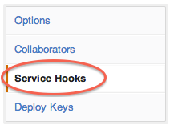

Docker Hub上自动构建
===

###自动构建

自动化构建是一个特殊的功能，允许您在Docker Hub构建集群中指定源代码仓库的`Dockerfile`来构建。该系统将从存储库复制一份，并使用存储库内容构建Dockerfile。由此产生的镜像将被上传到注册表，并且自动生成标记。

自动化构建有许多优势。例如，用户使用自动化构建必须是可信的，这就要求构建镜像的精确性。

此外，存储库的注册表上的Dockerfile提供给任何人浏览。自动化基础优势是自动化构建。这确保你的存储库总是最新的。

自动化构建支持 GitHub 和 BitBucket私有和公有的仓库。

###设置Github自动化构建

为了设置一个自动化构建，首先，需要与一个GitHub链接到你的Docker账户。这将允许注册表能查看你的存储库。

>注：目前，我们需要有读写权限，因为docker hub需要设置一个服务钩子。虽然没有其他人使用你的账户，这是Github管理权限的方式，很抱歉！

点击开始Automated Builds选项卡，然后选择[+ Add New.](https://registry.hub.docker.com/builds/add/)

选择[Github服务](https://registry.hub.docker.com/associate/github/)

然后按照说明授权和连接你的github账户到Docker Hub。

创建一个自动构建

你可以[创建一个自动构建](https://registry.hub.docker.com/builds/github/select/)从你的公有或者私有的Github仓库中的`Dockerfile`。

Github 组织

GitHub组织一旦你的会员身份以公开组织的形式出现在GitHub上。为了验证，你可以查看Github上你组织的成员选项卡。

Github服务钩子

您可以按照以下步骤配置自动构建的GitHub服务挂钩:

<table class="table table-bordered">
  <thead>
    <tr>
      <th>Step</th>
      <th>Screenshot</th>
      <th>Description</th>
    </tr>
  </thead>
  <tbody>
    <tr>
      <td>1.</td>
      <td></td>
      <td>登录到Github.com，并转到您的存储库页面。点击右侧页面“设置”。
	为了做到这一点，您必须具有管理员权限的存储库中。</td>
    </tr>
    <tr>
      <td>2.</td>
      <td></td>
      <td>点击页面左侧的“Webhooks & Services”。</td></tr>
      <tr><td>3.</td>
      <td></td><td>查找服务标记"Docker" ，并点击它.</td></tr>
      <tr><td>4.</td><td></td>
      <td>确认"Active"是被选中，然后点击“Update settings”按钮以保存您的更改。</td>
    </tr>
  </tbody>
</table>

###设置BitBucket自动构建

为了设置自动构建，你需要先把BitBucket连接到你的Docker Hub账户，这将允许存储库查看你的存储库。

点击 Automated Builds选项卡，然后选择+ Add New.。 

选择的bitbucket服务。 

然后按照指示，授权和您的bitbucket帐户连结至Docker Hub。

创建自动构建

你可以使用任何你的公共或者私有的BitBucket仓库中的`Dockerfile` 来创建你的自动创建。

###Dockerfile和自动构建

在构建过程中，我们将复制Dockerfile内容。我们也将添加它到Docker Hub，可以从Docker社区来查看仓库页面。

###README.md

如果你的存储库有一个`README.md`文件，我们将使用它作为存储库的描述。

>警告：如果你需要在创建之后修改描述。它会在下一次自动构建完成之后被改写。要进行修改，从Git仓库修改`README.md`。我们会寻找`Dockerfile`同一目录下的`README.md`。

###建立触发器

如果你需要另一种方式来触发GitHub or BitBucket自动构建，你可以设置构建触发。当你打开构建触发一个自动构建,它会给你一个网址,你可以发送POST请求。这将触发自动构建过程,类似于GitHub webhooks。

建立触发器可用Settings选项卡下的每一个自动构建。

>注：你在五分钟内只能触发一个构建，如果你已经进行一个构建，或你最近提交了构建请求，这些请求将被忽略。你可以再设置页面来找到最后10条触发日志来验证是否一切正常工作。

###Webhooks

也可以使用 Webhooks来自动构建， Webhooks在存储库推送成功后被访问。

该webhook调用将生成一个HTTP POST如下面的JSON：

	{
	   "push_data":{
	      "pushed_at":1385141110,
	      "images":[
	         "imagehash1",
	         "imagehash2",
	         "imagehash3"
	      ],
	      "pusher":"username"
	   },
	   "repository":{
	      "status":"Active",
	      "description":"my docker repo that does cool things",
	      "is_automated":false,
	      "full_description":"This is my full description",
	      "repo_url":"https://registry.hub.docker.com/u/username/reponame/",
	      "owner":"username",
	      "is_official":false,
	      "is_private":false,
	      "name":"reponame",
	      "namespace":"username",
	      "star_count":1,
	      "comment_count":1,
	      "date_created":1370174400,
	      "dockerfile":"my full dockerfile is listed here",
	      "repo_name":"username/reponame"
	   }
	}

Webhooks在每个自动生成的设置选项卡下。

>注意：如果你想测试你的webhook出那么我们建议使用像requestb.in的工具。 

###资源库链接

资源库链接的方式来关联一个与另一个自动化构建。如果一个得到更新，连接系统还会触发一个构建为其他自动生成。这使得它很容易让你的自动化构建最新的。

要添加一个链接，去一个自动生成的设置页面，点击储存库链接。然后输入你想要有链接的库的名称。

>警告：不过，您可以添加多个存储库的链接，你应该非常小心。自动构建之间的双向关系会造成一个永不停止的构建循环。
